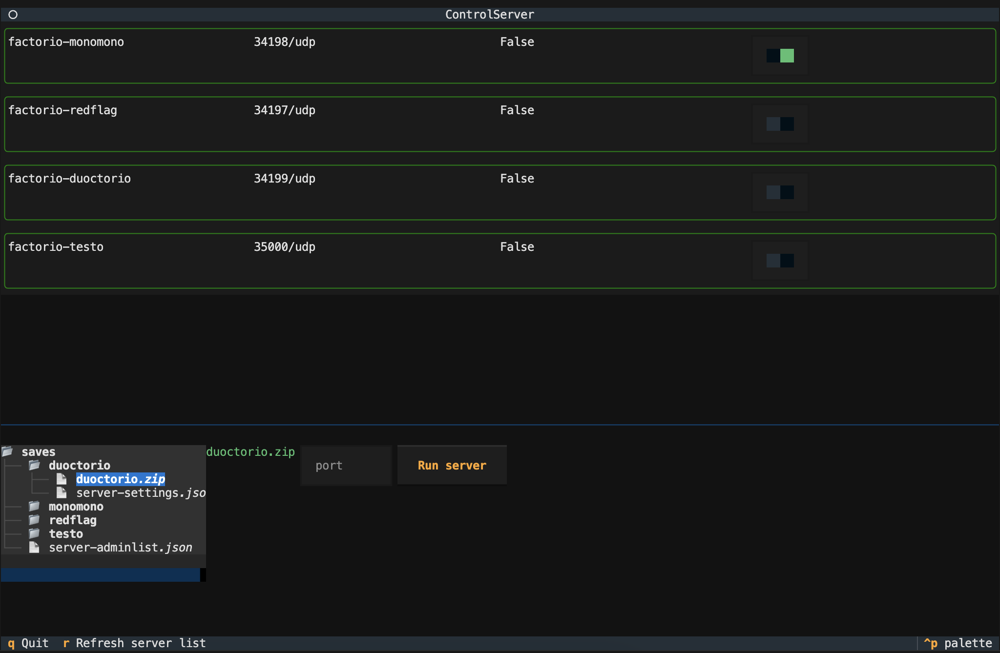

# Factorio Containers and TUI control

This is a passion project for running multiple factorio server instances on a single host in a containerized fashion.
This project as it currently is implemented assumes a home network and a local connection to the game instances.
As a result, none of the advanced networking settings that a remotely hosted solution may have are implemented.
If you choose to try this out, you may need to modify your firewall rules.

## Test environment

The development is done on a local homelab running Fedora operating system.
The container runtime env used is `podman`
The containers are run as root but this should work in a rootless setup as well

## Getting started

0. Install `podman`, more [here](https://podman.io/)
1. In your local `saves` folder, every savegame should have it's own subfolder with your save zipfile and the server-settings.json. in the `saves` folder, place your server-adminlist.json (will be used for every game)

```bash
saves/
├── duoctorio
│   ├── duoctorio.zip
│   └── server-settings.json
├── redflag
│   ├── redflag.zip
│   └── server-settings.json
├── server-adminlist.json
```

2. Build the container image from the provided Containerfile

```bash
podman build -f Containerfile -t factorio-headless:latest
```

3.1 Launch container using a shell command (Use a port number of your choice)

```bash
SAVEDIR=./saves/your-savename/ PORT=34198 ./run_instance.sh
```

3.2 Launch container using a command line graphical interface (TUI)

```bash
# create a python virtual environment
python -m venv .venv && source .venv/bin/activate
# Install the packages in use (podman and textual)
pip install -r requirements.txt

# Run the podman socket to be able to control containers from python
systemctl start podman.socket

# Run the TUI
./server_control.py
#Or
python server_control.py
```

TUI screenshot:


On the top are the available containers. Turn them off/on with the switches on the right.
Below is a savefile selector to spin up a new container. Click the zip savefile and designate a port number, then click `Run server`

4. If you want to use the python wrapper yourself, import the factorio_server's class 


